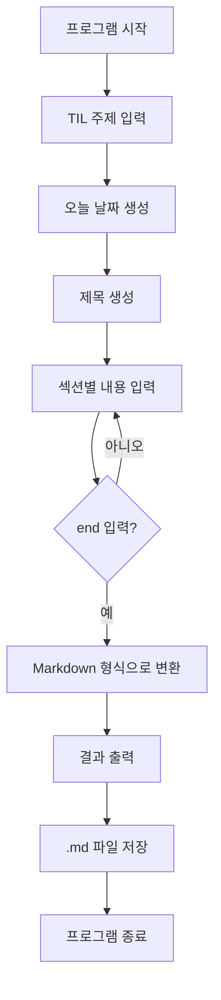

# 📝 TIL Maker CLI

## 소개

TIL Maker CLI는 카카오테크 부트캠프 학습 내용을 Markdown 형식으로 정리하기 위해 만든 Python CLI 프로그램입니다.

사용자는 오늘의 TIL 주제와 섹션별 내용을 입력하고, 프로그램은 정해진 구조에 맞춰 Markdown 결과를 터미널에 출력합니다. 출력된 내용은 카카오테크 부트캠프 배움일기 플랫폼에 복사해 사용할 수 있으며, 동시에 `harry-til/YYYY-MM-DD.md` 파일로 저장되어 GitHub에도 기록할 수 있습니다.

## 주요 기능

- 오늘 날짜 기반 TIL 제목 생성
- 고정된 TIL 섹션 순서 제공
- 섹션별 여러 줄 입력 지원
- Markdown 문서 생성
- `harry-til/YYYY-MM-DD.md` 파일 저장

## 사용 기술

- Python 3.13
- Click 8.4.0

## 디렉토리 구조

```txt
KTB4-Harry-AI/
├── harry-til/
│   └── YYYY-MM-DD.md
└── weekly-challenge/
    └── week01-cli/
        ├── README.md
        ├── requirements.txt
        └── til-maker.py
```

## 설치 및 실행 방법

1. 1주차 과제 디렉토리로 이동합니다.

```bash
cd weekly-challenge/week01-cli
```

2. 의존성을 설치합니다.

```bash
pip install -r requirements.txt
```

3. 프로그램을 실행합니다.

```bash
python til-maker.py
```

`--subject` 옵션으로 TIL 주제를 바로 전달할 수도 있습니다.

```bash
python til-maker.py --subject "Python CLI"
```

## TIL 문서 구조

생성되는 TIL 문서는 아래 섹션을 기준으로 구성됩니다.

- 핵심 배운 내용
- 수업 중 생긴 궁금증
- 더 알아볼 내용
- 기타 메모
- 오늘의 회고

## 사용 예시

```txt
오늘의 TIL 주제를 입력하세요 : Python 자료구조

[핵심 배운 내용]
내용을 입력하세요. (종료하려면 end를 입력하세요)
### 딕셔너리

- 키와 값 쌍을 요소로 가지는 자료형
- 키를 통해 값을 빠르게 조회할 수 있음
end
```

생성되는 Markdown 예시는 아래와 같습니다.

```md
# [KTB] 2026-05-17 TIL - Python 자료구조

## 핵심 배운 내용

### 딕셔너리

- 키와 값 쌍을 요소로 가지는 자료형
- 키를 통해 값을 빠르게 조회할 수 있음
```

## 프로그램 흐름



## 설계 방향

처음에는 사용자가 자유롭게 입력한 메모를 자동으로 분류하는 방식을 고민했습니다.

하지만 자연어 내용을 기준으로 섹션을 자동 분류하는 것은 1주차 과제 범위보다 복잡하다고 판단했습니다. 그래서 프로그램이 정해진 섹션을 순서대로 제시하고, 사용자가 각 섹션에 맞는 내용을 입력하는 반자동 구조화 방식을 선택했습니다.

## 개선 방향
